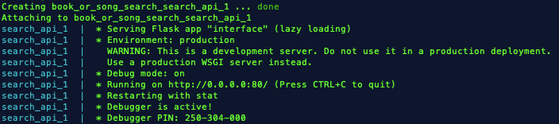

# SONG/BOOK SEARCH SERVICE

## INSTALLATION and EASY run
- clone repository
- in directory Book-and-Song-Search/app
- run ```make install```
- run ```make run```

## REQUIREMENTS
- If user has docker installed and the docker engine up and running, then skip to [Run-with-docker](#Run-with-docker)
- If not already installed, please install the following packages

    - pip install flask
    - pip install requests

## How to run

**1. Run with docker**
  - Clone repository to destination of choice
  - Navigate to the folder with the file [docker-compose.yml](docker-compose.yml)
  - On the terminal run the command:
      ```bash
        docker-compose up
      ``` 
  - After a while, the terminal should be something like this: 
    - 
  - In the browser, go to http://localhost:5000

**2. Run without docker**
- Clone to directory of choice, using git clone, if found on git, else extract zip file in directory of choice
- On terminal (macOS/Linux), type the command : python interface.py
- A server on local host is initiated, go to browser and type :

    - http://127.0.0.1:5000/search?query=pretty+little+fears

    - Note that + resembles the spaces, to search for the string "pretty little fears" 
      1. Note that the current implementation won't allow more than one user to make requests.
         - This is because I have used, localhost.
         - To allow multiple users, provide the ip address as host, port number, and turn the threaded parameter to true, when running the flask API.
         - Just uncomment the line: app.run(host=HOST, port = PORT, threaded = True), in [interface.py](interface.py)

      2. If this is the case, replace, 127.0.0.1 with your IP address and 5000 with your port number.
        - TIP : just run the app after making changes in 1 above, and the proper address to reach and make a query should be shown on the terminal, as shown below :
         - ![correct_address]
## Structure of results
 **1. Successfull call**
  - The flask api returns results that provide the status code, and then the results body.
  - If successfull call is made, and the results are valid, the status code returned is 200, and the results, are in a form of a list of dictionaries.
  - Additionally, a response time is also provided for that particular search.
  - In the list of dictionaries, dictionaries (10 in total), are sorted in alphabertical order, and each dictionary contains a key, value pair for artist/author, title ,type item found (book#volume or song).
  - In the case that the song has no Kind tag, the type of item is replaced by the wrapperType , which could be, for example, track, audiobook, e.t.c
    
    - Some books from the API seem not to return the author, although this may not be the case if searched from google.com
      - Still investigating how this could be.
    - Note that author is a list, incase there is more than one author for the book
    - This is different to the song results, which show co-artists as features
    -  In the case that there is no song title in the results, the collectionType is used instead, this is shown as title, with three astericks (*) before the collection name, in the title field.
       -  An example is a string search for money. i.e http://127.0.0.1:5000/search?query=money, the result :
```json
         "items": [
      {
        "artist": "Jim Rohn", 
        "title": "***Success Equations/Personal Development (Unabridged)", 
        "type": "audiobook"
      }
```

         - Appears when the song title is not available, thus the three astericks before the title name.
    
  - Below is an example of a successfull call to both the book and song search, for the search string "pretty little fears" :
  
```json
{
  "Status": {
    "Book_search ": {
      "response_time": 0.483109, 
      "status_code": 200
    }, 
    "Song_search": {
      "response_time": 0.131463, 
      "status_code": 200
    }
  }, 
  "items": [
    {
      "author": [
        "Lavinia FITZ-AUBYN"
      ], 
      "title": "Lavinia Fitz-Aubyn, with other tales, sketched from life", 
      "type": "books#volume"
    }, 
    {
      "author": [
        "Alexandre Dumas"
      ], 
      "title": "Memoirs of a Physician", 
      "type": "books#volume"
    }, 
    {
      "artist": "luv jo\u00eb", 
      "title": "Pretty Little Fears", 
      "type": "song"
    }, 
    {
      "artist": "Leem Supreme", 
      "title": "Pretty Little Fears", 
      "type": "song"
    }, 
    {
      "artist": "6LACK", 
      "title": "Pretty Little Fears (feat. J. Cole)", 
      "type": "song"
    }, 
    {
      "artist": "6LACK", 
      "title": "Pretty Little Fears (feat. J. Cole)", 
      "type": "song"
    }, 
    {
      "artist": "Tori Deal", 
      "title": "Pretty Little Fears (feat. Jordan Wiseley)", 
      "type": "song"
    }, 
    {
      "author": [
        "United States. Congress. Senate. Committee on Small Business", 
        "United States. Congress. Senate. Select Committee on Small Business. Subcommittee on Taxation"
      ], 
      "title": "Tax Problems of Small Business", 
      "type": "books#volume"
    }, 
    {
      "author": [
        "Edinburgh tales"
      ], 
      "title": "The Edinburgh tales, conducted by mrs. Johnstone", 
      "type": "books#volume"
    }, 
    {
      "author": [
        "Theodore Edward Hook"
      ], 
      "title": "The Sutherlands. The man of many friends. Doubts and fears", 
      "type": "books#volume"
    }
  ]
}
```

**2.Unsuccesifull call:**

- All call results return status code, and results.
- In the case of an unseccesifull call, the appropriate error code is return, some of which are documented in the next section
- The result, depends on the type of call.
- Most failure results, have the same structure, like the one shown below, which shows a status code 400:
  
```json
{
  "results": {
    "message": "Required parameter: query"
  }, 
  "status_code": 400
}
```

**2.b) Possible error codes from this service**
- Status code = 200
    - Success

- Status code = 400
     -  Bad Request Error e.g query parameter missing
- Status code = 500
     - Internal server error , generic error  

- Below is possible if both Google book search and itunes song search fail with an internal server error (generic, server won't really specify the kind of error)
  
```json
        {
  "Status": {
    "Book_search ": {
      "response_time": -1, 
      "status_code": 500
    }, 
    "Song_search": {
      "response_time": -1, 
      "status_code": 500
    }
  }, 
  "items": []
}
```
- If only one fails, and the other succesifull, the other will return the expected results, while the failed one returns it's respective failure result from the snippet above.

## Other Metrics
- In the case one wants information on the availability of the APIs behind, i.e the itunes store API and the google books api, searching in the url bar of the browser the term : 
  - http://127.0.0.1:5000/health
    -  will return the response status and time taken to reach the respective APIs
 - Could be useful when trying to determin if the APIs behind the service are working, and perhaps there is an issues with this service.
